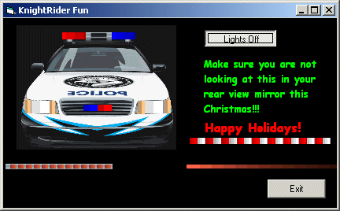

<div align="center">

## Uses \(101\)  for Ulli's KnightRider ActiveX Control


</div>

### Description

Well, I only came up with 3 so far. Why you ask? Well, I downloaded this some time ago and thought it was a neat effect but what to use it for? Well, I found a little time to kill and went through all my downloaded code. I re-discovered this and decided to see if there was a fun way to make use of it. I found a couple and decided to resubmit this to PSC to see what some of you evil geniuses could do with it. If you got a little time to play, let's see what you got. ;-) Let's have some fun dammit....

My revisions:

Removed the intrinsic VB timer and added Paul Caton's timer class and a reference to the WinSubHook2 typelib included in the zip. In my opinion, Paul's code is one the most useful ever submitted to PSC. I have found a multitude of uses for it and it is simply awesome coding. Also, I formatted the code and changed variable names to my taste. Forgive me Ulli. Finally, I added a TripComplete event for use in my demo.

To use, make sure you have a reference to the WinSubHook2 typelib. If for some reason you can not see the effect, substitute the use of the Alphablend (msimg32.dll) API for the use of the GDIAlphablend (gdi32.dll) API call. The parameters are identical so you should only have to change the function name, uncomment the Alphablend api call, and comment the GDIAlphablend API call. Votes are not necessary but if you vote, they are Ulli's.....
 
### More Info
 


<span>             |<span>
---                |---
**Submitted On**   |2004-12-17 14:24:56
**By**             |[AlT](https://github.com/Planet-Source-Code/PSCIndex/blob/master/ByAuthor/alt.md)
**Level**          |Intermediate
**User Rating**    |5.0 (10 globes from 2 users)
**Compatibility**  |VB 6\.0
**Category**       |[Custom Controls/ Forms/  Menus](https://github.com/Planet-Source-Code/PSCIndex/blob/master/ByCategory/custom-controls-forms-menus__1-4.md)
**World**          |[Visual Basic](https://github.com/Planet-Source-Code/PSCIndex/blob/master/ByWorld/visual-basic.md)
**Archive File**   |[Uses\_\(101\)18304212172004\.zip](https://github.com/Planet-Source-Code/alt-uses-101-for-ulli-s-knightrider-activex-control__1-57764/archive/master.zip)

### API Declarations

```
GDIAlphablend
Alphablend
```


